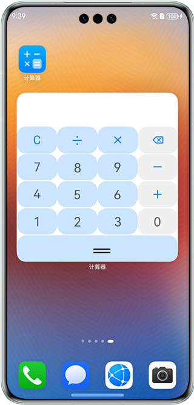

# 跨平台科学计算器

### 介绍

本示例基于ArkUI-X框架实现了一个跨平台科学计算器，支持HarmonyOS、Web浏览器、平板等多端运行。采用三层架构设计，业务逻辑层实现85%代码复用，UI表现层支持响应式布局和平台特性适配。

**核心特性：**
- 🧮 **基础计算**：四则运算、运算符优先级、小数运算、除零处理
- 🔬 **科学计算**：平方根、对数、三角函数、反三角函数、指数运算、阶乘
- 📱 **跨平台支持**：HarmonyOS原生、Web浏览器（PC/移动）、平板
- 🎨 **响应式布局**：自适应屏幕尺寸，支持横竖屏切换
- ⌨️ **多输入方式**：触控、键盘快捷键、触控笔（平板）
- 💡 **平板优化**：双面板布局、高分辨率适配、60fps动画

### 效果预览

| 添加卡片                                             | 卡片预览                                                    | 操作卡片                                             |
|--------------------------------------------------|---------------------------------------------------------|--------------------------------------------------|
|  |  |  |

### 使用说明

#### HarmonyOS设备
1. 长按应用图标，将卡片添加到桌面
2. 对桌面上的卡片进行计算操作

#### Web浏览器
1. 运行 `npm run build:web` 构建Web版本
2. 部署 `web/dist` 目录到Web服务器
3. 通过浏览器访问，支持PC和移动设备

#### 开发环境
```bash
# 安装依赖
npm install

# 运行测试
npm test

# 代码检查
npm run lint

# 构建HarmonyOS版本
npm run build:harmony

# 构建Web版本
npm run build:web
```

### 工程目录

```
├── common/src/main/ets               // 业务逻辑层（跨平台复用）
│  ├── engine                         // 计算引擎
│  │  ├── CalculatorEngine.ets        // 核心计算逻辑
│  │  ├── ExpressionParser.ets        // 表达式解析
│  │  ├── RPNConverter.ets            // 逆波兰表达式转换
│  │  └── RPNEvaluator.ets            // 表达式求值
│  ├── state                          // 状态管理
│  │  └── StateManager.ets            // 状态管理器
│  ├── types                          // 类型定义
│  │  └── ExpressionTypes.ets         // 状态、事件类型
│  ├── utils                          // 工具函数
│  │  ├── NumberUtils.ets             // 数字处理
│  │  └── ValidationUtils.ets         // 输入校验
│  └── constants                      // 常量定义
│     ├── MathConstants.ets           // 数学常量
│     └── ButtonConstants.ets         // 按钮配置
├── crossplatform/src/main/ets        // UI表现层（跨平台）
│  ├── components                     // UI组件
│  │  ├── CalculatorDisplay.ets       // 显示屏组件
│  │  ├── CalculatorButton.ets        // 按钮组件
│  │  └── ScientificPanel.ets         // 科学计算面板
│  └── pages                          // 页面
│     └── CalculatorPage.ets          // 计算器主页面
├── entry/src/main/ets                // HarmonyOS入口（原有）
│  ├── calc/pages
│  │  └── CardCalc.ets                // 计算器卡片页面
│  ├── entryability
│  │  └── EntryAbility.ets            // 程序入口
│  └── entryformability
│     └── EntryFormAbility.ets        // 卡片生命周期
├── web/                              // Web端配置
│  └── src/                           // Web源码
├── entry/src/main/resources          // 应用资源目录
├── build-profile.json5               // 多平台构建配置
├── package.json                      // 依赖管理
└── tsconfig.json                     // TypeScript配置
```

### 相关权限

不涉及。

### 约束与限制

1. **HarmonyOS设备**：支持HarmonyOS 5.0.5 Release及以上
2. **Web浏览器**：支持Chrome 80+、Firefox 75+、Safari 13+、Edge 80+
3. **屏幕适配**：支持320px-1920px屏幕宽度
4. **开发工具**：DevEco Studio 5.0.5 Release及以上
5. **代码复用率**：业务逻辑层≥85%

### 技术栈

- **框架**：ArkUI-X（跨平台声明式UI框架）
- **语言**：ArkTS/TypeScript
- **状态管理**：@State、@Prop响应式装饰器
- **测试**：Jest
- **代码质量**：ESLint + TypeScript严格模式